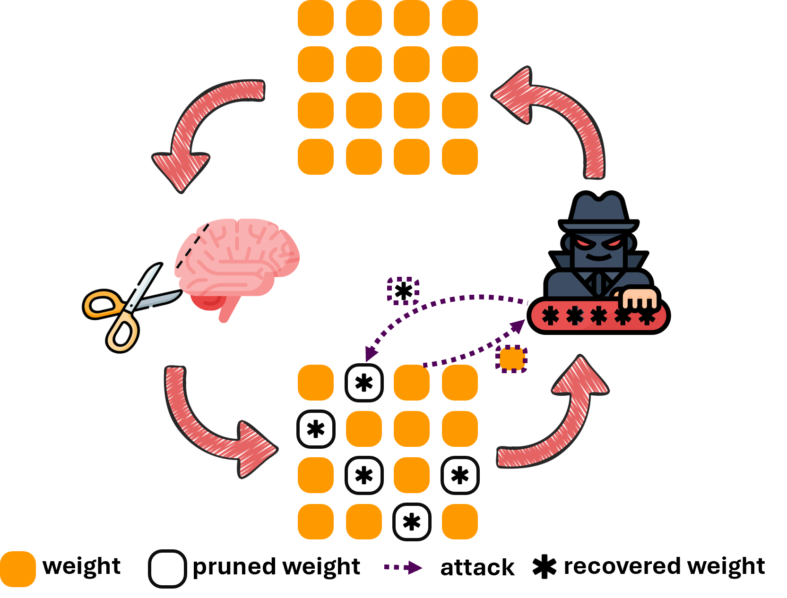
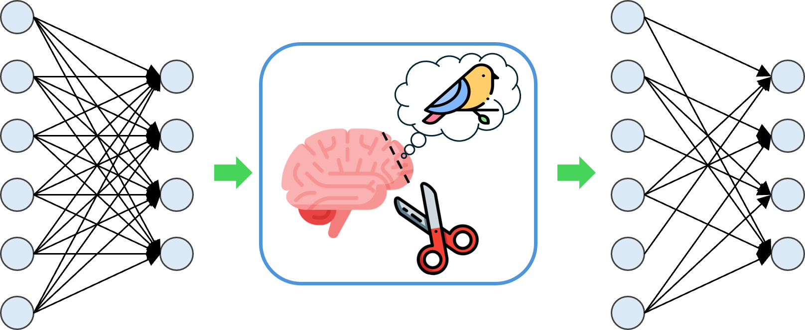
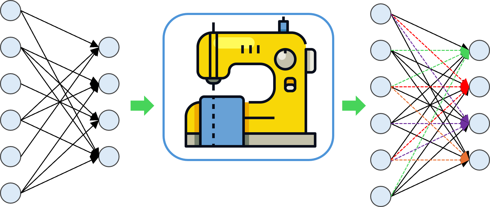
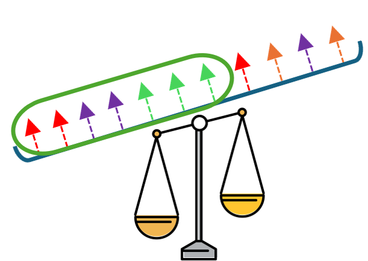

# Roots Beneath the Cut

Code for the paper - **Roots Beneath the Cut: Uncovering the Risk of Concept Revival in Pruning-Based Unlearning for Diffusion Models**

## Introduction

Pruning-based unlearning has recently emerged as a fast, training-free, and data-independent approach to remove undesired concepts from diffusion models. It promises high efficiency and robustness, offering an attractive alternative to traditional fine-tuning or editing-based unlearning. However, in this paper we uncover a hidden danger behind this promising paradigm. We find that the locations of pruned weights, typically set to zero during unlearning, can act as side-channel signals that leak critical information about the erased concepts. To verify this vulnerability, we design a novel attack framework capable of reviving erased concepts from pruned diffusion models in a fully data-free and training-free manner. Our experiments confirm that pruning-based unlearning is not inherently secure, as erased concepts can be effectively revived without any additional data or retraining. Extensive experiments on diffusion-based unlearning based on concept related weights lead to the conclusion: once the critical concept-related weights in diffusion models are identified, our method can effectively recover the original concept regardless of how the weights are manipulated. Finally, we explore potential defense strategies and advocate safer pruning mechanisms that conceal pruning locations while preserving unlearning effectiveness, providing practical insights for designing more secure pruning-based unlearning frameworks.

## Environment Setup

Create Environment from the `environment.yml` file.

`cd env`

`conda env create -f environment.yml`

`conda activate concept_revival`

## Obtain the Unlearned Model

To obtain the unlearned model for a concept `<target>`, run the following-

`python revive.wanda --target="$target" --skill_ratio 0.02`

`python revive.save_union_over_time --target="$target" --timesteps 10 --skill_ratio 0.02`

`<target>` is the concept that we want to erase. Replace `<target>` with any of -

&nbsp; 1. Artist Styles - `Van Gogh, Monet, Pablo Picasso, Da Vinci, Salvador Dali`. Example - base prompt = `a cat` and target prompt = `a cat in the style of Van Gogh`

&nbsp; 2. Nudity - `naked`. Example - base prompt = `a photo of a man` and target prompt = `a photo of a naked man`

&nbsp; 3. Objects (Imagenette classes) - `golf ball, parachute, church, french horn, chain saw, gas pump, candle, mountain bike, racket, school bus, spider web, starfish`.

&nbsp; Example - base prompt = `a room` and target prompt = `a parachute in a room`

The argument `skill_ratio` denotes the sparsity level which defines the top-k% neurons considered for WANDA pruning. This command saves skilled neurons discovered for every timestep and layer in a different .pkl file as a sparse matrix. We recommend using `0.02` for all object and artist style tasks, and `0.01` for the nudity task.

**Note: You can also use your own unlearned model obtained by detecting concept-related weights, as long as the locations of the concept-related weights remain identifiable.**

## Matrix Completion

To recover the pruned matrix, run the following-

**(Note: You need to set the concept-related weights to zero first if you are using your own unlearned model.)**

`python -m revive.read_weights --target="$target"`

`python -m revive.matrix_completion_lterative_Soft-Thresholded_SVD_gpu --target="$target"`

## Top-K Sign Retention

To preserve the signs with Top-k magnitudes, run the following-

`python -m revive.top_k_sign_retention --target="$target" --top_ratio="$top_ratio"`

You could try `top_ratio` from `(0.2, 0.3, 0.4, 0.5, 0.6, 0.7, 0.8)`, as the recovery performance varies across different concepts for this parameter. All experiments in the paper use `0.6`.

## Neuron Max Scaling

To maximize the magnitudes of remained signs, run the following-

`python revive.neuron_max_scaling --target="$target" --csv_folder "path"`
